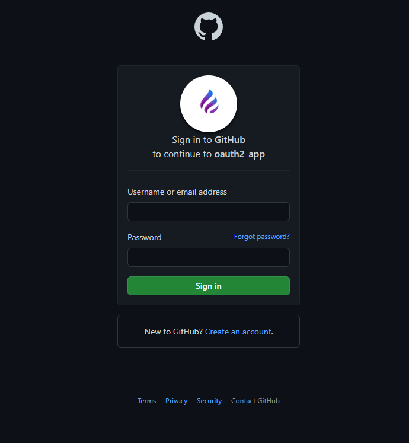

# Car Dealership API with OAuth 2.0 / Momento de Avaliação 1

Repositório criado no âmbito do projeto desenvolvido para a Unidade Curricular de 'Desenvolvimento Web II', uma cadeira de segundo ano na 'UMAIA', no curso de 'Informática'. 
Desenvolvido pelo Grupo 2: André Cacheira ([@Cacheira14](https://github.com/Cacheira14)), Bruno Sousa ([@brunomfsrw1](https://github.com/brunomfsrw1)), Raul Gonçalves ([@RaulGoncalves21x](https://github.com/RaulGoncalves21x)).

## Breve Descrição

Construção de uma API que suporte as relações entre os recursos 'Carro', 'Fabricante', 'Dono' e 'Motor', recorrendo ao OAuth 2.0 de forma a proteger determinados verbos do protocolo HTTP nos recursos. 
Desta forma, o recurso 'Carro' será o recurso central, já que este terá um dono, um fabricante e um motor.

## Organização do Repositório

* **Código fonte API** presente na pasta [API](API).
* **Documentação** presente na pasta [doc](doc/).
* **[Documento MYSQL](database_v1.sql)** para criação da Base de Dados.
* **[Documento Docker-compose](docker-compose.yaml)** para puxar as imagens dos repositórios DockerHub e montar a aplicação.

## Galeria

|||||
| :---: | :---: | :---: | :---: |
|||||

## Tecnologias

De forma a desenvolver este projeto, foi necessário recorrer à utilização de várias tecnologias, usufruindo também do recurso a frameworks e bibliotecas. 
Mais especificamente:

* [OAuth 2.0](https://oauth.net/2/)
* [JavaScript](https://developer.mozilla.org/en-US/docs/Web/JavaScript/About_JavaScript)
* [NodeJS](https://nodejs.org/en/about/)
* [MySQL](https://dev.mysql.com/doc/refman/8.0/en/what-is-mysql.html)
* [OpenAPI](https://swagger.io/docs/specification/about/)

### Frameworks e Bibliotecas

* [Docker](https://docs.docker.com/get-started/overview/)
* [NodeJS](https://nodejs.org/en/about/)

## Relatório

### Apresentação do Projeto
* Capítulo 1: [Apresentação do Projeto](doc/capitulo1.md)
### Recursos
* Capítulo 2: [Recursos](doc/capitulo2.md)
### Produto
* Capítulo 3: [Produto](doc/capitulo3.md)

## Equipa

* André Cacheira / Perfil GitHub: [@Cacheira14](https://github.com/Cacheira14)
* Bruno Sousa / Perfil GitHub: [@brunomfsrw1](https://github.com/brunomfsrw1)
* Raul Gonçalves / Perfil GitHub: [@RaulGoncalves21x](https://github.com/RaulGoncalves21x)
